# **Rock, Paper, Scissors, Lizard, Spock - Game**

## **Game Intro**

A simple Rock, Paper, Scissors, Lizard, Spock game that is meant to entertain people of all ages. Playable against the computer, and reminds the user about CD/DVD disks for some reason. :)

**The game website is live on Github Pages [Linked Here](https://tiyko.github.io/RPSLS-Game/)**

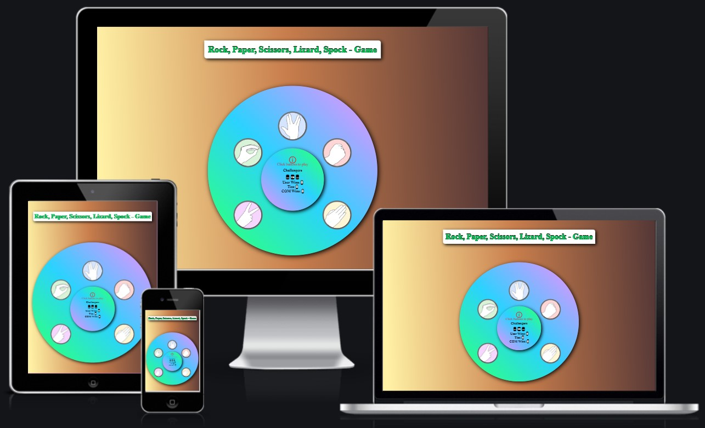

## **Index**

1. [**Game Intro**](#game-intro)
1. [**UX Design**](#ux-design)
    * [**Using The Strategy and the Scope Plane**](#using-the-strategy-and-the-scope-plane)
      * [**Target audience**](#target-audience)
    * [**Using The Structure Plane**](#using-the-structure-plane)
      * [**User Stories**](#user-stories)
      * [**Website Goals**](#website-goals)
1. [**UI Design**](#ui-design)
    * [**Wireframes**](#wireframes)
    * [**Features**](#features)
      * [**How to play**](#how-to-play)
      * [**Game matrix**](#game-matrix)
      * [**Colors**](#colors)
      * [**Title**](#title)
      * [**Game container**](#game-container)
      * [**Buttons**](#buttons)
      * [**Game information container**](#game-information-container)
      * [**Gameover container**](#gameover-container)
1. [**Deployment**](#deployment)
1. [**Testing and Debugging**](#testing-and-debugging)
    * [**Testing**](#testing)
    * [**Debugging**](#debugging)
1. [**Post developement testing**](#post-developement-testing)
    * [**HTML Validation**](#html-validation)
    * [**CSS Validation**](#css-validation)
    * [**Contrast Validation**](#contrast-validation)
    * [**Performance**](#performance)
      * [***Desktop Lighthouse scores***](#desktop-lighthouse-scores)
      * [***Mobile Phones Lighthouse scores***](#mobile-phones-lighthouse-scores)
1. [**Credits**](#credits)
    * [**General reference:**](#general-reference)
    * [**Content and Media**](#content-and-media)

## **UX Design**

* *The UXD was made taking into consideration "The Five plans"*

### **Using The Strategy and the Scope Plane**

#### **Target audience**

* People of all ages who like to play computer games.

### **Using The Structure Plane**

#### **User Stories**

* As a user, I want the game information to be easily accessed.
* As a user, I want the game to be easy to navigate.
* As a user, I want the game to be intuitive.
* As a user, I want the game to have clear rules.
* As a user, I want the game to be entertaining.

#### **Website Goals**

* The site’s users want to play an online game that is fun and easy to use based on project Idea 1, Rock, Paper, Scissors, Lizard, Spock.
* The site’s users want to play an online game that has elements of chance to entertain users.
* The site’s users want to play an online game that has a limited number of tries before the game is over.
* The site’s users want to play an online game that has a score tracking system.
* The site’s users want to play an online game against the computer.

[***Back to Index***](#index)

## **UI Design**

* *Taking into consideration the "Five Planes" I have used the "Skeleton Plane" and the "Surface Plane" to make the UI design.**

### **Wireframes**

To follow a pattern and make my life easier before I engaged in creating the website, first I drew wireframes using [diagrams.net](https://app.diagrams.net/).

* Desktop wireframes:

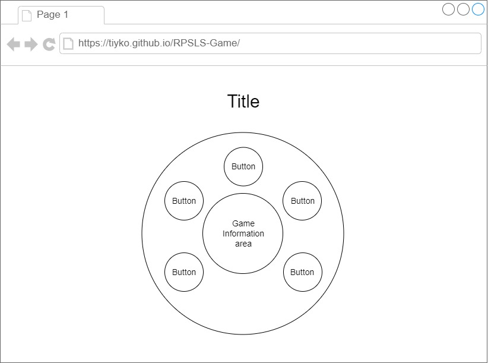

[***Back to Index***](#index)

* Mobile wireframes:

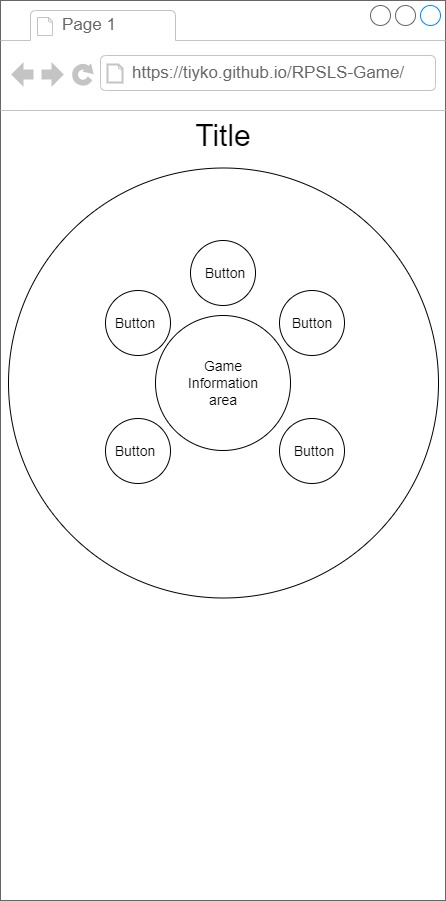

[***Back to Index***](#index)

### **Features**

#### **How to play**

* There are 5 characters of choice: Rock, Paper, Scissors, Lizard, Spock.
* Each of them defeats 2 characters and loses to the other 2:
  * Rock defeats Scissors and Lizard.
  * Paper defeats Rock and Spock.
  * Scissors defeats Paper and Lizard.
  * Lizard defeats Paper and Spock.
  * Spock defeats Rock and Scissors.

[***Back to Index***](#index)

#### **Game matrix**

* Using JavaScript and this matrix I was able to create the game outcome on who will win, lose, and when it's a tie.

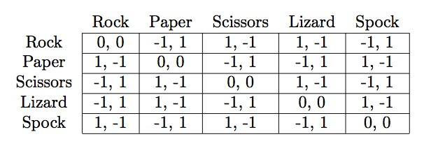

#### **Colors**

* Designed to look like a CD/DVD on a table.
* The choice of gradient colors was picked using [this website](https://www.eggradients.com/).
* The gradient background colors of the website increase in contrast on the right side of the screen expressing as if the light is coming from the left side of the screen.

#### **Title**

* Since only the game is displayed on the entire page, the game title is large on the middle top of the screen.
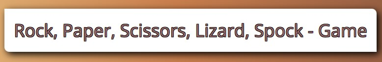

[***Back to Index***](#index)

#### **Game container**

* The game container is the largest circle and contains the game's outcome elements.
* The game container has a shadow leaning to the right to give an illusion as if the light was coming from the left side of the screen.

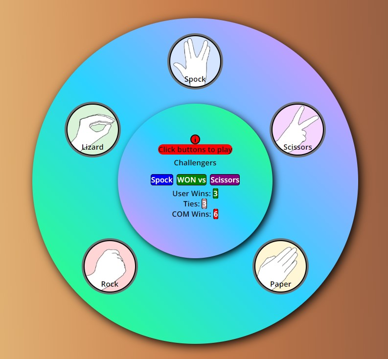

[***Back to Index***](#index)

#### **Buttons**

* There are 5 buttons on the screen representing the user's choices.
* All of the 5 buttons have a background picture to show the user what character is used to play with.
* All of the 5 buttons have a name to let the user know the character's name.

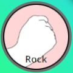

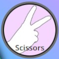
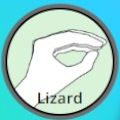
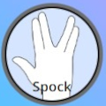

#### **Game information container**

**Inside this container all the outcomes of the game are displayed:**

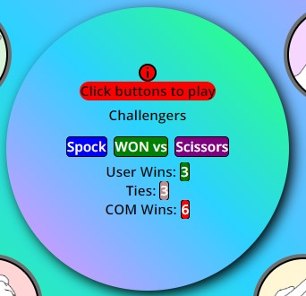

* **Tooltip icon**  containing the game's rules:
  * When the user is mouse hovering over the information icon a pop-up with game rules will be displayed.

* **Game Rules**
  * The game rules contain a picture showing the game outcome for every character.
  * The game will finish when the user or the computer reaches 10 wins and it can even end in a tie.

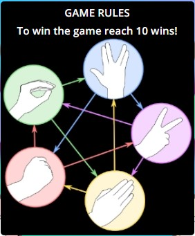

* **Call to action**  paragraph asking the user to take action and press the buttons to play the game.

* **Challengers containers: 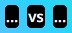**
  * The title of the challengers 
  * First, the challengers' area appears with 3 dots versus 3 dots.
  * As the user is clicking buttons and playing the game the name of the chosen characters will be displayed.
  * Every character appears with a background color matching their button color. 
  * The outcome of the challenge is displayed between the characters' names in green for the user, red for the computer, and pale brown for a tie.

* **Scoring system:** 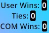
  * Under the challengers containers the scoring system, is presented, displaying the number of wins for the user and computer and as well the number of ties.
  * The scoring number background colors match the game's outcome in green for the user, red for the computer, and pale brown for a tie. 

#### **Gameover container**

* When any User wins, COM wins or Ties reach 10 that game will restart counting to 0 and another container will be displayed:
  * Informing the user if they win, lose, or ended in a tie.
  * Also a button is shown to let the user play the game again.

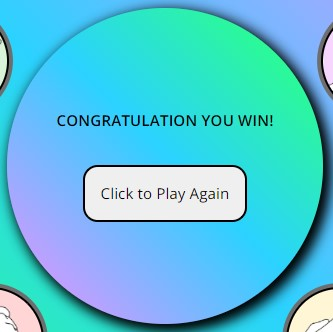

[***Back to Index***](#index)

## **Deployment**

To deploy the website on GitHub pages, I used the following procedure:

1. From inside the website's repository I clicked the last tab, "Settings".
1. In the "Settings" tab to the left-hand side a menu with the title "General" can be found. Here in the second group "Code and automation" I clicked the last option, "Pages".
1. Inside "GitHub Pages" and right under it there is a section with the title "Source" with 3 options:
    * Select Branch: main
    * Select Folder: /(root)
    * Click save: your website will be deployed.

[***Back to Index***](#index)

## **Testing and Debugging**

### **Testing**

* After I published the game on the GitHub Pages I continuously checked the game's behavior and responsiveness to multiple devices.
* In addition, have asked friends with Apple devices to check the game and its responsiveness.
* I used to test the website on the following web browsers:
  * Brave,
  * Chrome,
  * Firefox,
  * Opera,
  * Safari,
  * Edge.

### **Debugging**

* Issue: Game still running after the game is over
  * After reaching the end of the game and the final message would be displayed, if the user continued to press character buttons the game would still be running and recording the score in the background of the final message.
* Solution found:
  * Created a new variable called inProgress in the JavaScript file and called it in the game's function and as well in the game's final message.

[***Back to Index***](#index)

## **Post developement testing**

### **HTML Validation**

* To test my HTML code I used [W3C HTML Validator](https://validator.w3.org/nu/) and one error was returned:
  * Button elements cannot contain paragraph elements and to fix this **issue** I changed them to span elements.

### **CSS Validation**

* To test my CSS code I used [W3C Jigsaw CSS Validator](https://jigsaw.w3.org/css-validator/) with no errors returned.

### **Contrast Validation**

* To make sure I had no contrast issues with my colors as I picked myself without using a palletee I used ["a11y Color Contrast Accessibility Validator"](https://color.a11y.com/).

### **Performance**

* Lighthourse performance
  * During development, I used the Lighthouse now and then to make sure my website performance score stays as high up as possible.

#### ***Desktop Lighthouse scores***

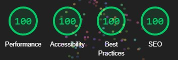

#### ***Mobile Phones Lighthouse scores***

* Due to variation from the desktop performance I had to make a second set screenshot for mobile device performance.

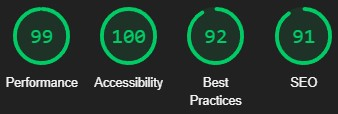

[***Back to Index***](#index)

## **Credits**

* Thanks to the people that helped me when I got stuck during the development of the project:
  * [Dick Vlaanderen](https://github.com/dickvla) - my assigned mentor by code institute who has helped me fix a bug with the game running in the background. Thank you, Sir!
  * My friend Robert who has listened to all my newbie questions and helped me understand better Javascript. Thank you!

### **General reference:**

* Besides the course's material I also used W3schools, MDN web docs, Stack Overflow, and Youtube for general or a more in-depth reference.

### **Content and Media**

* The content and structure of the game's page was written by myself.
* Font linked from [Google Fonts](https://fonts.google.com/).
* The tooltip picture was taken from [Wikimedia Commons](https://commons.wikimedia.org/wiki/Main_Page)
  * [Rock, Paper, Scissors, Lizard, Spock](https://upload.wikimedia.org/wikipedia/commons/thumb/b/bd/Pierre_ciseaux_feuille_l%C3%A9zard_spock.svg/768px-Pierre_ciseaux_feuille_l%C3%A9zard_spock.svg.png)

[***Back to Index***](#index)
